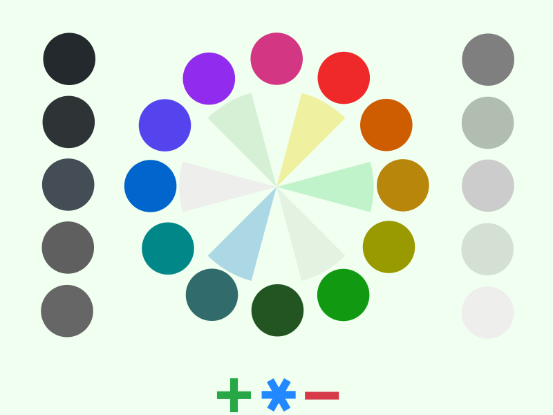

# organic-green color theme

Light green color theme for Emacs.

## Installation:

```lisp
(package-install 'organic-green-theme)
```

Then in your emacs config somewhere:

```lisp
(load-theme 'organic-green t)
```

<p align="center">
  
</p>


## License

Copyright (c) 2009-2023 Kostafey <kostafey@gmail.com>

Distributed under the General Public License 2.0+
